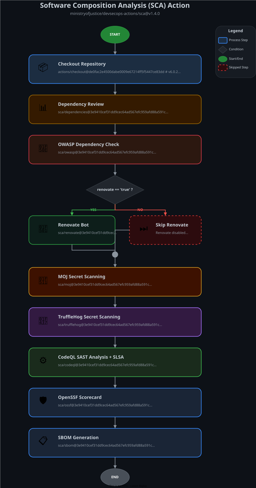

# 🔍 Software Composition Analysis (SCA) Action

Enterprise-Grade Security Scanning for Software Supply Chain

---

[](../LICENSE)
[](https://www.gov.uk/government/organisations/ministry-of-justice)

## Overview

A comprehensive, enterprise-grade composite action for software composition analysis, dependency management,
and security review across the entire software supply chain. This action orchestrates 9 specialized security
tools to provide complete visibility into your application's dependencies, vulnerabilities, and supply chain risks.

**Key Capabilities:**

- **Dependency Vulnerability Detection** - Multi-tool scanning for known CVEs
- **Secret Scanning** - Dual-engine secret detection (MOJ + TruffleHog)
- **SAST Analysis** - CodeQL semantic code analysis
- **SBOM Generation** - CycloneDX-compliant bill of materials
- **Automated Updates** - Renovate bot for dependency management
- **Security Posture** - OpenSSF Scorecard assessment

---

## 📋 Table of Contents

- [Architecture](#️-architecture)
- [Features](#-features)
- [What It Does](#-what-it-does)
- [Usage Examples](#-usage-examples)
- [Inputs](#-inputs)
- [Required Permissions](#-required-permissions)
- [Configuration](#️-configuration)
- [Outputs](#-outputs)
- [Troubleshooting](#-troubleshooting)
- [Contributing](#-contributing)

---

## 🏗️ Architecture

### Component Workflow



Each component is an independent composite action that can be configured individually:

1. **📦 Repository** - Secure code retrieval with token authentication
2. **📊 Dependencies** - GitHub Dependency Review for PR vulnerability scanning
3. **🔎 OWASP** - OWASP Dependency-Check for CVE detection (CVSS ≥7.0 fails)
4. **🔁 Renovate** - Automated dependency updates with intelligent grouping
5. **🔑 Secrets (MOJ)** - Ministry of Justice custom secret detection
6. **🐷 TruffleHog** - Entropy-based secret scanning (700+ detectors)
7. **⚙️ CodeQL** - Semantic SAST analysis for security vulnerabilities
8. **🛡️ OpenSSF** - Security posture assessment (18+ checks)
9. **📋 SBOM** - Software Bill of Materials generation (CycloneDX)

---

## ✨ Features

### Core Security Capabilities

- ✅ **Zero Configuration**: Works out-of-the-box with sensible defaults
- ✅ **Multi-Language Support**: JavaScript, TypeScript, Python, Java, .NET, Go, Ruby, Swift, Kotlin, C/C++
- ✅ **Pull Request Integration**: Automated security checks on every PR
- ✅ **GitHub Security Integration**: Results appear in Security tab and Code Scanning alerts
- ✅ **Compliance Ready**: NTIA SBOM compliant, meets Executive Order 14028
- ✅ **Customizable**: Override defaults with configuration files
- ✅ **Container Scanning**: Docker image vulnerability detection and SBOM generation
- ✅ **Automated Remediation**: Renovate creates PRs for dependency updates

### Security Tools Integrated

| Tool                         | Purpose                             | Output Format     |
| ---------------------------- | ----------------------------------- | ----------------- |
| **GitHub Dependency Review** | PR-based vulnerability detection    | GitHub Alerts     |
| **OWASP Dependency-Check**   | CVE detection with CVSS scoring     | SARIF, HTML, JSON |
| **Renovate**                 | Automated dependency updates        | Pull Requests     |
| **MOJ Secret Scanner**       | Custom secret patterns              | Log Output        |
| **TruffleHog**               | Entropy + pattern secret detection  | JSON              |
| **CodeQL**                   | Static application security testing | SARIF             |
| **OpenSSF Scorecard**        | Repository security posture         | JSON, Markdown    |
| **Syft**                     | SBOM generation                     | CycloneDX JSON    |

### Key Benefits

- 🔒 **Defense in Depth**: Multiple overlapping security layers
- 🚀 **Fast Execution**: Parallel scanning where possible
- 📊 **Comprehensive Reporting**: SARIF, JSON, HTML outputs
- 🔄 **Automated Updates**: Keep dependencies current automatically
- 🏆 **Best Practices**: Implements OpenSSF recommendations
- 📦 **Supply Chain Security**: Complete visibility into dependencies

---

## 🎯 What It Does

### 1. 📦 Repository Checkout

**Action**: `sca/repository/`  
**Purpose**: Secure code retrieval with token authentication

- Clones repository with full Git history
- Authenticates using provided GitHub token
- Prepares workspace for subsequent scanning

### 2. 📊 Dependency Review

**Action**: `sca/dependencies/`  
**Purpose**: GitHub-native vulnerability scanning for pull requests

- Compares dependency changes between base and head branches
- Identifies newly introduced vulnerabilities
- Validates license compliance
- Blocks PRs with high-severity vulnerabilities
- **Customizable**: Use `dependency-review-config-file` input

### 3. 🔎 OWASP Dependency-Check

**Action**: `sca/owasp/`  
**Purpose**: CVE detection with CVSS threshold enforcement

- Scans all project dependencies against National Vulnerability Database
- Enforces CVSS score threshold (≥7.0 fails build)
- Generates SARIF report for GitHub Code Scanning
- Supports 30+ package ecosystems
- Includes CVE details and remediation guidance

### 4. 🔁 Renovate

**Action**: `sca/renovate/`  
**Purpose**: Automated dependency updates

- Detects outdated dependencies
- Creates pull requests with updates
- Intelligent grouping of related updates
- Respects semantic versioning
- Configurable update strategies
- **Customizable**: Set `renovate: "false"` to disable

### 5. 🔑 MOJ Secret Scanner

**Action**: `sca/moj/`  
**Purpose**: Ministry of Justice custom secret detection

- Detects UK government-specific secrets
- AWS credentials, API keys, tokens
- Custom regex patterns for MOJ services
- Fast, lightweight scanning
- Fails on secret detection

### 6. 🐷 TruffleHog

**Action**: `sca/trufflehog/`  
**Purpose**: Entropy-based secret scanning

- 700+ built-in secret detectors
- Entropy analysis for high-entropy strings
- Git history scanning
- Verified secret detection
- Excludes false positives
- **Customizable**: Use `trufflehog-config-file` input

### 7. ⚙️ CodeQL

**Action**: `sca/codeql/`  
**Purpose**: Semantic code analysis (SAST)

- Deep semantic analysis of source code
- Detects security vulnerabilities and bugs
- Supports 10+ programming languages
- Pre-built security queries
- Custom query support
- SARIF upload to GitHub Code Scanning
- **Customizable**: Use `codeql-config-file` and `codeql-upload-findings` inputs

### 8. 🛡️ OpenSSF Scorecard

**Action**: `sca/ossf/`  
**Purpose**: Security posture assessment

- Evaluates 18+ security best practices
- Checks branch protection, code review, signed commits
- Dependency update automation verification
- Vulnerability disclosure process check
- CI/CD security assessment
- Generates scorecard with actionable recommendations

### 9. 📋 SBOM Generation

**Action**: `sca/sbom/`  
**Purpose**: Software Bill of Materials

- Generates CycloneDX 1.5 JSON SBOMs
- Repository dependency SBOM
- Container image SBOMs (if configured)
- NTIA minimum elements compliant
- Executive Order 14028 compliant
- **Customizable**: Use `docker-images-file` for container scanning

---

## 📖 Usage Examples

### Quick Start - Minimal Configuration

The simplest way to enable comprehensive security scanning:

```yaml
name: SCA
run-name: SCA ⚡️

on:
  schedule:
    - cron: "0 0 * * *" # Daily at midnight UTC
  pull_request:
    branches: ["main"]

permissions: {}

jobs:
  sca:
    name: Software Composition Analysis
    runs-on: ubuntu-latest
    timeout-minutes: 30

    permissions:
      contents: write
      pull-requests: write
      issues: write
      security-events: read

    steps:
      - name: Run SCA
        uses: ministryofjustice/devsecops-actions/sca@v1.3.0
        with:
          token: ${{ secrets.GITHUB_TOKEN }}
```

**This provides:**

- ✅ Dependency vulnerability scanning
- ✅ Secret detection (2 engines)
- ✅ CodeQL SAST analysis
- ✅ OWASP security checks
- ✅ OpenSSF Scorecard
- ✅ SBOM generation
- ✅ Automated dependency updates

### Production Configuration

Advanced configuration with custom settings:

```yaml
name: SCA
run-name: SCA ⚡️

on:
  schedule:
    - cron: "0 2 * * *" # Daily at 2 AM UTC

  pull_request:
    branches: ["main", "develop", "release/*"]
    types: [opened, synchronize, reopened]

  push:
    branches: ["main"]

  workflow_dispatch:

permissions: {}

jobs:
  sca:
    name: Software Composition Analysis
    runs-on: ubuntu-latest
    timeout-minutes: 45

    permissions:
      contents: write
      pull-requests: write
      issues: write
      security-events: read
      actions: read

    steps:
      - name: Run SCA with Custom Configuration
        uses: ministryofjustice/devsecops-actions/sca@v1.3.0
        with:
          token: ${{ secrets.GITHUB_TOKEN }}

          # Dependency Management
          renovate: "true"
          renovate-version: "42.64.1"
          node-version: "24.11.1"

          # Custom Configurations
          dependency-review-config-file: ".github/config/dependency-review.yml"
          trufflehog-config-file: ".github/config/trufflehog.yml"
          codeql-config-file: ".github/config/codeql-config.yml"
          codeql-upload-findings: "always"

          # Container Scanning
          docker-images-file: "docker-images.json"
```

### Enterprise Configuration - Matrix Strategy

For organisations scanning multiple configurations:

```yaml
name: SCA Matrix
run-name: SCA Matrix ⚡️

on:
  schedule:
    - cron: "0 3 * * *"
  workflow_dispatch:

permissions: {}

jobs:
  sca:
    name: SCA (${{ matrix.config-name }})
    runs-on: ubuntu-latest
    timeout-minutes: 60

    strategy:
      fail-fast: false
      matrix:
        include:
          - config-name: "Strict"
            codeql-config: ".github/codeql-strict.yml"
            renovate: "true"
          - config-name: "Standard"
            codeql-config: ".github/codeql-standard.yml"
            renovate: "true"

    permissions:
      contents: write
      pull-requests: write
      issues: write
      security-events: read

    steps:
      - name: Run SCA
        uses: ministryofjustice/devsecops-actions/sca@v1.3.0
        with:
          token: ${{ secrets.GITHUB_TOKEN }}
          renovate: ${{ matrix.renovate }}
          codeql-config-file: ${{ matrix.codeql-config }}
          docker-images-file: "docker-images.json"
```

### PR-Only Configuration

Lightweight scanning for pull requests:

```yaml
name: SCA - PR Check
run-name: SCA PR Check ⚡️

on:
  pull_request:
    branches: ["main"]
    types: [opened, synchronize]

permissions: {}

jobs:
  sca-pr:
    name: SCA Pull Request Check
    runs-on: ubuntu-latest
    timeout-minutes: 30

    permissions:
      contents: read
      pull-requests: write
      security-events: read

    steps:
      - name: Run SCA
        uses: ministryofjustice/devsecops-actions/sca@v1.3.0
        with:
          token: ${{ secrets.GITHUB_TOKEN }}
          renovate: "false" # No automated updates on PRs
          codeql-upload-findings: "always"
```

### Disable Renovate

For repositories with external dependency management:

```yaml
steps:
  - name: Run SCA without Renovate
    uses: ministryofjustice/devsecops-actions/sca@v1.3.0
    with:
      token: ${{ secrets.GITHUB_TOKEN }}
      renovate: "false"
```

---

## 🔧 Inputs

All inputs are optional except `token`. Designed for zero-configuration operation.

| Input                           | Type   | Required | Default   | Description                                                                                                                         |
| ------------------------------- | ------ | -------- | --------- | ----------------------------------------------------------------------------------------------------------------------------------- |
| `token`                         | string | **Yes**  | N/A       | GitHub token with required permissions (contents: read/write, pull-requests: read/write, issues: read/write, security-events: read) |
| `renovate`                      | string | No       | `true`    | Enable or disable Renovate bot for automated dependency updates                                                                     |
| `renovate-version`              | string | No       | `42.64.1` | Renovate CLI version to use (specify without 'v' prefix)                                                                            |
| `node-version`                  | string | No       | `24.11.1` | Node.js version to use for SBOM generation with Syft                                                                                |
| `dependency-review-config-file` | string | No       | `""`      | Path to custom dependency review config (e.g., `.github/dependency-review-config.yml`)                                              |
| `trufflehog-config-file`        | string | No       | `""`      | Path to custom TruffleHog secret scanning configuration                                                                             |
| `codeql-config-file`            | string | No       | `""`      | Path to custom CodeQL query configuration for SAST                                                                                  |
| `codeql-upload-findings`        | string | No       | `always`  | Control SARIF upload to Code Scanning. Set to `never` if using GitHub's default CodeQL setup                                        |
| `docker-images-file`            | string | No       | `""`      | Path to JSON file with Docker image URIs for container SBOM generation                                                              |

---

## 🔐 Required Permissions

Your workflow must explicitly grant these permissions:

| Permission        | Level     | Purpose                                              |
| ----------------- | --------- | ---------------------------------------------------- |
| `contents`        | **write** | Repository checkout, file access, and update commits |
| `pull-requests`   | **write** | Creating and updating pull requests (Renovate)       |
| `issues`          | **write** | Creating issues for security findings                |
| `security-events` | **read**  | Accessing and uploading security scan results        |

**Example:**

```yaml
permissions:
  contents: write
  pull-requests: write
  issues: write
  security-events: read
```

---

## ⚙️ Configuration

### Docker Images Configuration

Enable container vulnerability scanning and SBOM generation by providing a JSON file.

#### File Structure

Create a JSON file (e.g., `docker-images.json` or `sources.json`) in your repository root:

```json
{
  "images": [
    "ghcr.io/ministryofjustice/devsecops-hooks:latest",
    "ghcr.io/ministryofjustice/devsecops-hooks:v1.0.0",
    "docker.io/library/nginx:1.25-alpine",
    "mcr.microsoft.com/dotnet/aspnet:8.0"
  ]
}
```

#### Requirements

- ✅ Must contain an `images` property as an array
- ✅ Each element should be a fully qualified image URI with registry
- ✅ Include version tags (avoid `latest` in production)
- ✅ Supports all OCI-compliant registries (Docker Hub, GHCR, ACR, ECR, GCR, etc.)
- ✅ Multiple images can be scanned in a single workflow run

#### Usage

```yaml
- uses: ministryofjustice/devsecops-actions/sca@v1.3.0
  with:
    token: ${{ secrets.GITHUB_TOKEN }}
    docker-images-file: "docker-images.json"
```

### Dependency Review Configuration

Create `.github/dependency-review-config.yml`:

```yaml
# Fail build on vulnerabilities with severity >= moderate
fail-on-severity: moderate

# Allowed licenses
allow-licenses:
  - MIT
  - Apache-2.0
  - BSD-3-Clause
  - ISC

# Denied licenses (GPL variants)
deny-licenses:
  - GPL-3.0
  - AGPL-3.0

# Allow specific packages despite license
allow-dependencies-licenses:
  - pkg:npm/@example/package
```

### TruffleHog Configuration

Create `.github/trufflehog-config.yml`:

```yaml
# Exclude specific paths
exclude_paths:
  - "test/**"
  - "docs/**"
  - "*.md"

# Disable specific detectors
exclude_detectors:
  - detector-name-1
  - detector-name-2

# Only scan specific detectors
only_verified: true
```

### CodeQL Configuration

Create `.github/codeql-config.yml`:

```yaml
name: "Custom CodeQL Config"

# Query suites
queries:
  - uses: security-extended
  - uses: security-and-quality

# Paths to exclude
paths-ignore:
  - "test/**"
  - "docs/**"
  - "vendor/**"

# Paths to include (overrides ignore)
paths:
  - "src/**"
```

---

## 📤 Outputs

### Generated Artifacts

The action generates the following artifacts available in workflow runs:

#### 1. SBOM Artifacts

- **`sca-sbom-repository.cdx.json`** - Repository dependency SBOM (CycloneDX 1.5)
- **`sca-sbom-<image-name>.cdx.json`** - Per-container image SBOM

Artifacts are retained for **90 days** and available for download.

#### 2. SARIF Reports

Uploaded to GitHub Code Scanning:

- **OWASP Dependency-Check** - CVE findings
- **CodeQL** - SAST findings

View in: Repository → Security → Code scanning alerts

#### 3. TruffleHog Results

- **JSON output** - Detailed secret detection results
- Available in job logs

#### 4. OpenSSF Scorecard

- **Markdown report** - Displayed in job summary
- **JSON output** - Available for processing

### GitHub Security Tab Integration

Security findings appear in:

- **Code scanning alerts** - CodeQL, OWASP findings
- **Dependabot alerts** - Dependency vulnerabilities
- **Security overview** - Repository security posture

---

## 🔍 Troubleshooting

### Common Issues

#### Issue: "Insufficient permissions"

**Cause**: Workflow lacks required permissions

**Solution**:

```yaml
permissions:
  contents: write
  pull-requests: write
  issues: write
  security-events: read
```

#### Issue: CodeQL build failure

**Cause**: Auto-build failed for compiled languages

**Solution**: Add manual build steps before CodeQL analyse:

```yaml
- name: Build
  run: |
    mvn clean install
    # or: dotnet build
    # or: make
```

#### Issue: "OWASP scan fails with CVSS ≥7.0"

**Cause**: High-severity vulnerability detected

**Solution**:

1. Review OWASP report in artifacts
2. Update vulnerable dependencies
3. Or add suppression file if false positive

#### Issue: Renovate not creating PRs

**Cause**:

- `renovate: "false"` is set
- No updates available
- Rate limiting

**Solution**:

1. Verify `renovate: "true"`
2. Check Renovate logs in workflow
3. Wait for rate limit reset

#### Issue: Docker image SBOM not generated

**Cause**: Invalid `docker-images-file` format

**Solution**: Verify JSON structure:

```json
{
  "images": ["registry/image:tag"]
}
```

### Debug Mode

Enable detailed logging:

```yaml
env:
  ACTIONS_STEP_DEBUG: true
  ACTIONS_RUNNER_DEBUG: true
```

---

## 📚 Best Practices

### Versioning Strategy

```yaml
# ✅ Alternative: Commit SHA (maximum stability)
uses: ministryofjustice/devsecops-actions/sca@9babea875cafae0e3b05a5ec5aca76d6b560c42e

# ⚠️ Not recommended: Branch names
uses: ministryofjustice/devsecops-actions/sca@v1.3.0
```

### Security Best Practices

```yaml
# ✅ Use GitHub's built-in token
token: ${{ secrets.GITHUB_TOKEN }}

# ❌ Never hardcode tokens
token: ghp_abc123...

# ✅ Use custom tokens only if needed
token: ${{ secrets.CUSTOM_GITHUB_TOKEN }}
```

### Scheduling Recommendations

```yaml
# ✅ Daily scans (recommended)
schedule:
  - cron: "0 0 * * *"

# ✅ Weekly scans (minimum)
schedule:
  - cron: "0 0 * * 1"

# ⚠️ Hourly (too frequent)
schedule:
  - cron: "0 * * * *"
```

---

## 🤝 Contributing

See the main repository [Contributing Guidelines](../README.md#-contributing) for details.

### Testing Changes

```bash
# Test individual components
cd sca/codeql
# Review action.yml

# Validate YAML
npm run validate:yml

# Test with act
act -W .github/workflows/sca.yml
```

---

## 📄 License

This project is licensed under the **MIT License** - see the [LICENSE](../LICENSE) file for details.

---

## 📞 Support

### Getting Help

- **📖 Documentation**: This README and inline action documentation
- **🐛 Bug Reports**: [GitHub Issues](https://github.com/ministryofjustice/devsecops-actions/issues)
- **✨ Feature Requests**: [GitHub Issues](https://github.com/ministryofjustice/devsecops-actions/issues)
- **🔒 Security Issues**: See [Security Policy](https://github.com/ministryofjustice/devsecops-actions?tab=security-ov-file)

---

## 🏆 Acknowledgments

This action leverages:

- **GitHub CodeQL** - Semantic code analysis
- **OWASP Dependency-Check** - CVE scanning
- **Renovate Bot** - Dependency automation
- **TruffleHog** - Secret detection
- **OpenSSF Scorecard** - Security assessment
- **Syft** - SBOM generation

---

## 🔗 Related Documentation

- [CodeQL Documentation](https://codeql.github.com/docs/)
- [OWASP Dependency-Check](https://owasp.org/www-project-dependency-check/)
- [Renovate Documentation](https://docs.renovatebot.com/)
- [TruffleHog](https://github.com/trufflesecurity/trufflehog)
- [OpenSSF Scorecard](https://scorecard.dev/)
- [Main Repository README](../README.md)

---

Made with ❤️ by the Ministry of Justice UK - 🐼 PandA Team
